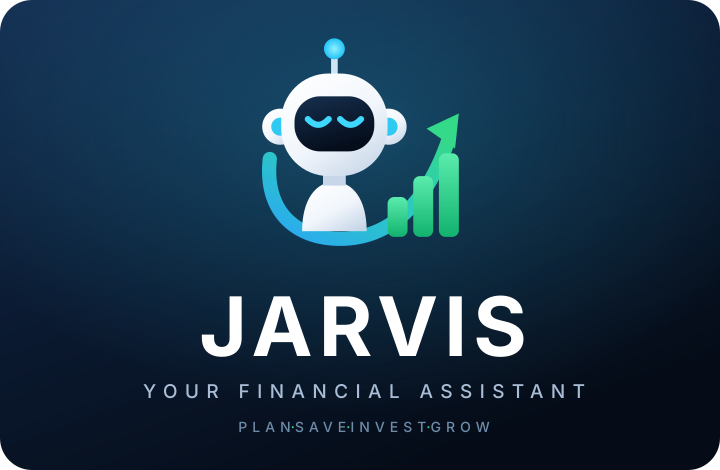
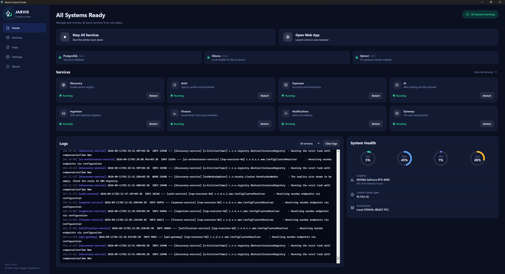
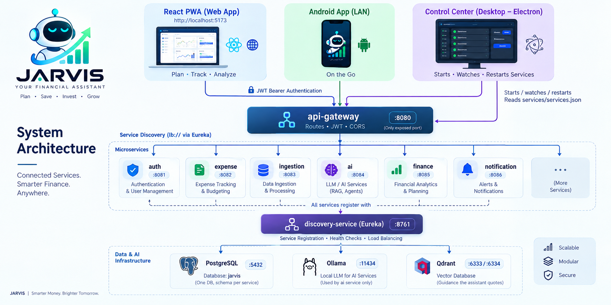
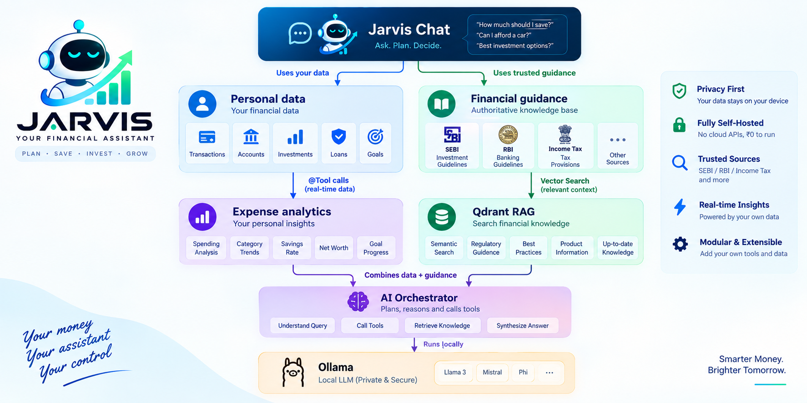

<p align="center">
  
</p>

<div align="center">

# JARVIS — Self-Hosted Personal Finance Assistant

**Plan · Save · Invest · Grow**

A "Jarvis"-style personal finance assistant for India: track expenses across multiple credit cards
and savings accounts, manage investments, loans and reminders, and ask a **local** AI agent about
your money. Fully self-hosted on your own PC — **₹0 to run**, no cloud AI APIs.

<br>

[](https://www.java.com/)
[](https://spring.io/projects/spring-boot)
[](https://react.dev/)
[](https://developer.android.com/)
[](https://www.electronjs.org/)
[](https://www.postgresql.org/)
[](https://ollama.com/)
[](https://qdrant.tech/)
[](LICENSE)

</div>

> ### 🟢 Status: running daily
>
> Eight Spring Boot microservices behind one gateway, with **three clients** on top — a React PWA,
> an **Android** SMS forwarder, and a **Windows desktop Control Center** that runs the whole stack.
> A household can share it: an administrator sees everything, everyone else sees only their own
> money.

---

## ✨ What it does

### 📥 Capture

Money gets into Jarvis three ways, and all three land in the same pipeline:

| | Route | What happens |
|---|---|---|
| 📱 | **Phone** | The Android app reads bank/UPI **transaction SMS** as they arrive and forwards them to `/api/ingest`. It queues durably on-device, so an outage or a dead Wi-Fi never loses one. |
| 📄 | **Statement import** | PDF/CSV statements and payslips, parsed and deduplicated against what the SMS already captured. |
| ✍️ | **By hand** | Add a transaction, account, investment or loan in the web app. |

### 🧠 Understand

The AI parser turns a raw alert into a typed transaction (amount, direction, merchant, account,
category), cleans the merchant name to one canonical form per shop, and spots the things a naive
parser gets wrong: a card EMI counted once rather than twice, a transfer between your own accounts
recognised from a single bank's alert, a duplicate of an alert you already forwarded.

### 📊 Track

| | Domain | What you get |
|---|---|---|
| 💳 | **Accounts** | Credit cards, savings, wallets — with bills, statement dates and consolidated multi-card statements |
| 🧾 | **Transactions** | Full history, category rules, merchant aliases, transfer pairing, manual edits |
| 📈 | **Analytics** | Spend and earning by month and category, trends, savings rate, net worth |
| 💼 | **Investments** | Mutual funds, stocks, EPF, NPS, RD/FD, LIC endowment policies — valued, not just listed |
| 🏦 | **Loans** | Balances, EMIs and what each one costs you |
| 🎯 | **Goals** | What you are saving towards and how close you are |
| 📅 | **Calendar** | Bills, EMIs and reminders on the dates they fall due, with mark-as-paid |
| 👨‍👩‍👧 | **Household** | Members with their own logins, each scoped to their own money; one administrator sees all of it |
| 🔔 | **Notifications** | Card-expiry, payment-due and category-threshold alerts, pushed live over SSE |

### 💬 Ask

The Assistant answers from **your** numbers (`@Tool` calls into the expense analytics) and from
**published regulator guidance** (a Qdrant vector search over SEBI / RBI / Income Tax material),
picking whichever the question needs. Conversations are saved server-side, so the thread is there on
whichever client you open next.

---

## 📸 Screenshots

### 🖥️ Control Center

<div align="center">



</div>

All eight services with per-service **Restart**, the three dependencies it watches but doesn't own —
Qdrant reporting its indexed chunk count rather than just an open port — the same `logs\` files the
scripts write, and CPU/RAM/GPU/disk. One window, no terminal.

---

## 🏗️ Architecture

True microservices behind a single API gateway, discovered via Netflix Eureka. Every client — web,
phone and desktop — only ever talks to the gateway (`:8080`); the gateway routes by path to the
right service over `lb://`.

<div align="center">



</div>

```text
   React PWA (:5173)     Android app (LAN)     Control Center (Electron)
          │                     │                        │
          └──────── JWT Bearer ─┴──────────┐             │ starts / watches / restarts
                                           ▼             ▼
                            ┌───────────────────────┐  reads services/services.json
                            │      api-gateway      │  :8080  (only exposed port)
                            │  routes · JWT · CORS  │
                            └───────────┬───────────┘
     lb:// (Eureka) ─┬────────┬─────────┼─────────┬──────────┬──────────┐
            ▼        ▼        ▼         ▼         ▼          ▼          ▼
          auth   expense  ingestion    ai    finance   notification  (…)
         :8081    :8082     :8083    :8084    :8085       :8086
            └──────────────── all register with ─────────────────────┘
                          discovery-service (Eureka) :8761
                                       │
        PostgreSQL `jarvis` :5432   Ollama :11434        Qdrant :6333/:6334
       (one DB, schema per service) (ai only)     (guidance the assistant quotes)
```

> **Only `:8080` is exposed to clients.** The gateway owns routing, JWT fast-reject and CORS.

### 🧱 Services

| Service | Port | DB schema | Responsibility |
|---|---:|---|---|
| 🔎 **discovery-service** | `8761` | — | Netflix Eureka registry |
| 🚪 **api-gateway** | `8080` | — | Edge routing (`lb://`), JWT fast-reject, **sole CORS owner** |
| 🛡️ **auth-service** | `8081` | `auth` | Users + profile + household members; **signup/login → JWT** |
| 💳 **expense-service** | `8082` | `expense` | Accounts, transactions, categories, merchant aliases, analytics, dedup |
| 📥 **ingestion-service** | `8083` | `ingestion` | `/api/ingest` pipeline: raw alert → parse → persist |
| 🧠 **ai-orchestrator-service** | `8084` | `ai` | Spring AI agents (parser + Q&A), RAG over the guidance corpus, saved assistant conversations; **only** service that calls Ollama |
| 📈 **finance-service** | `8085` | `finance` | Members, investments, loans, goals, reminders, spend thresholds |
| 🔔 **notification-service** | `8086` | `notification` | Card-expiry / payment-due / threshold rules, delivered live over SSE |
| 🔐 **common-security** | — | — | Shared library: JWT token service, request filter, stateless security auto-config |

### 🗄️ Data

All services share the **single `jarvis` database**; each migrates into its **own Postgres schema**
(via Flyway + `hibernate.default_schema`) so their schemas never collide. See
[`services/README.md`](services/README.md) for the backend deep-dive.

```text
PostgreSQL :5432
      └── jarvis
          ├── auth      ├── ingestion   ├── finance
          ├── expense   ├── ai          └── notification
```

---

## 🛠️ Tech stack

<div align="center">

[](https://spring.io/projects/spring-cloud)
[](https://spring.io/projects/spring-security)
[](https://documentation.red-gate.com/flyway)
[](https://spring.io/projects/spring-ai)
[](https://vite.dev/)
[](https://tailwindcss.com/)
[](https://ui.shadcn.com/)
[](https://developer.android.com/compose)
[](https://github.com/features/actions)

</div>

- **☕ Backend** — Spring Boot 3.5 (Java 21), Spring Cloud 2025.0.0 (Gateway + Eureka + LoadBalancer),
  Spring Data JPA, Flyway, Spring Security (stateless JWT, BCrypt, jjwt 0.12).
- **🤖 AI** — Spring AI 1.1.8 → local **Ollama**. Parser `qwen3.5:9b` (structured output, thinking
  off); Q&A agent `qwen3.5:27b` with `@Tool` functions that call expense analytics over `WebClient`.
  Provider is a Spring profile (`local` default), so a cloud/bigger model is a config swap.
- **🐘 DB** — PostgreSQL 18 (local install, no Docker), one `jarvis` database, schema per service.
- **🔎 RAG** — Qdrant (1024-dim, Cosine) over regulator guidance, embedded with `bge-large` via
  Ollama and searched by the agent as a `@Tool` rather than as a pipeline stage.
- **🌐 Frontend** — React 19 + Vite + TypeScript, Tailwind v4, shadcn/ui (base-ui "nova"), Recharts,
  react-router, axios. Installable PWA.
- **📱 Android** — Kotlin + Jetpack Compose (Material 3), Room, WorkManager, OkHttp,
  kotlinx-serialization, EncryptedSharedPreferences, BiometricPrompt. minSdk 26, JDK 17.
- **🖥️ Desktop** — Electron 33 + React 19 + Vite + TypeScript, `systeminformation`, packaged as a
  per-machine NSIS installer by electron-builder.
- **🔐 Auth** — HS256 JWT issued by auth-service, validated at the gateway and re-validated by each
  service (defence in depth) with a shared secret. Service-to-service calls use an `X-Internal-Key`.
- **🔄 CI** — GitHub Actions: one tag-triggered workflow builds and tests everything and publishes
  the release (see [Releases](#releases-ci)).

---

## 📱 The three apps

### 🌐 Web — React PWA (`frontend/`)

The full product: dashboard, transactions, accounts, analytics, import, investments, loans, goals,
calendar, assistant, household settings and profile. Installable as a PWA. Every data domain is
backend-persisted — only the JWT, the theme and a few UI flags live in the browser.

### 📲 Android — Jarvis Sync (`android/`)

A Kotlin/Compose companion that captures bank/UPI **transaction SMS** in real time and forwards them
to `/api/ingest`, plus a compact dashboard, an investments/money tab, card bills with mark-as-paid,
and "Ask Jarvis".

- **📩 Never loses a message.** Captured SMS go into an on-device Room database and are delivered by
  a WorkManager job (network-constrained, exponential backoff, a 15-minute safety net and a
  boot-time re-arm). A message leaves the queue only on a definitive server response.
- **📡 Works offline.** The dashboard renders from a local cache; the session (server URL + JWT)
  lives in the DB, so the app opens straight to the dashboard with no network.
- **🔐 Stays logged in.** The password sits in EncryptedSharedPreferences so the background worker
  can silently re-login when the 24h JWT expires.
- **👆 Locked behind biometrics** — fingerprint, face or device PIN in front of the app.
- **📥 Inbox** — every transaction SMS already on the phone, month by month, with a **Sync** button.
  Safe to re-run: the server dedups.
- **👤 Scoped to one person.** A household member's phone shows only their own accounts and money.

> **Sideload only** — the SMS permissions it needs aren't grantable through the Play Store, which is
> fine for a self-hosted personal tool. Full detail in [`android/README.md`](android/README.md).

### 🖥️ Desktop — Jarvis Control Center (`desktop/`)

An Electron window that starts, watches and restarts the whole stack on Windows, so nothing needs a
terminal. Detail and behaviour under [Control Center](#control-center-windows-desktop-app) below.

---

## 📁 Repo layout

```text
jarvis/
│
├── services/                     # Spring Boot backend (parent POM, mvnw, start-all.ps1)
│   ├── common-security/          # Shared JWT/security library
│   ├── discovery-service/        # Eureka registry
│   ├── api-gateway/              # Gateway — the only port clients ever touch
│   ├── auth-service/             # Authentication, profile & household
│   ├── expense-service/          # Accounts, transactions, analytics
│   ├── ingestion-service/        # /api/ingest pipeline
│   ├── ai-orchestrator-service/  # Spring AI + Ollama + RAG
│   ├── finance-service/          # Investments, loans, goals, reminders
│   ├── notification-service/     # Alerts + SSE
│   └── services.json             # Ports & start order — read by every launcher
│
├── frontend/                     # React PWA
├── android/                      # Kotlin/Compose SMS forwarder
├── desktop/                      # Electron Control Center
│
├── corpus/                       # Financial guidance corpus
│   ├── manifest.json             # Source list + extraction notes
│   ├── text/                     # Extracted text (committed)
│   └── sources/                  # Originals (gitignored)
│
├── scripts/                      # Setup & RAG helpers
├── assets/                       # Brand assets & architecture diagrams
├── .github/                      # CI/CD and release workflow
│
├── start-jarvis.ps1              # One-window launcher for the whole stack
└── start-jarvis.cmd              # What the desktop shortcut runs
```

Brand assets and their usage rules are documented in
[`assets/brand/README.md`](assets/brand/README.md).

---

## ⚙️ Prerequisites

| | Requirement | Details |
|---|---|---|
| ☕ | **JDK 21** | Liberica full is what this is built against. No host Maven needed — use the bundled `services/mvnw`. |
| 🐘 | **PostgreSQL 18** | On `:5432`, with the role and database created once (below). |
| 🤖 | **Ollama** | On `:11434` with the models pulled — only needed for the AI service. |
| 🔎 | **Qdrant** | On `:6333`/`:6334` for the guidance corpus. Optional; the Control Center starts it. |
| 🟢 | **Node 20+** | For the frontend and the desktop app. |
| 📱 | **Android Studio** | Ladybug / 2024.2+ with a **JDK 17–21** — only if you're building the phone app. |

**PostgreSQL** — run once as the `postgres` superuser (`psql` lives at
`C:\Program Files\PostgreSQL\18\bin\psql.exe`):

```sql
CREATE ROLE jarvis WITH LOGIN PASSWORD 'jarvis';
CREATE DATABASE jarvis OWNER jarvis;
```

Each service creates and migrates its own schema on first start — no manual schema setup.

**Ollama models:**

```bash
ollama pull qwen3.5:9b
ollama pull qwen3.5:27b
```

**Android** — point `android/local.properties` at your SDK; Gradle 8.9 rejects the Java 25 bundled
with recent Android Studio builds.

---

## ▶️ Run (dev)

### 🚀 One click

A Desktop shortcut that does everything (build, all 8 services, the web app) in a single window,
with each service's logs colour-coded behind a `[name]` prefix. Create it once:

```powershell
powershell -ExecutionPolicy Bypass -File scripts\install-shortcut.ps1
```

After that, double-click **Jarvis** on the Desktop. Ctrl+C in that window shuts the whole stack
down. The same logs are written to `logs\<service>.log`. Flags, if you run it from a terminal:
`-NoBuild` skips the Maven build, `-NoBrowser` leaves the browser alone.

<a id="control-center-windows-desktop-app"></a>

### 🖥️ Control Center (Windows desktop app)

A window that starts, watches and restarts the whole stack, in `desktop/`. Build the installer:

```powershell
cd desktop
npm install
npm run dist        # release\Jarvis Control Center Setup 1.0.0.exe
```

`npm start` runs it without installing.

- **▶️ Opening it starts the stack**, but only what is not already listening — glancing at a healthy
  stack never restarts it.
- **🗄️ PostgreSQL and Ollama are watched, not managed.** Postgres down blocks starting at all,
  because every service would otherwise die on its first migration; Ollama down is only a warning.
- **📜 Logs come from `logs\`**, the same files the scripts write, so they show up whoever started
  the services.
- **🔽 Close minimises to the tray** and leaves everything running; the minimise button behaves
  normally. Quit from the tray menu, or turn the tray behaviour off in Settings.
- **⚙️ Services, ports and start order come from `services/services.json`** — the same file the
  PowerShell launchers read, so there is one list to keep right.

### 📲 Android app

```bash
cd android
./gradlew assembleDebug          # app/build/outputs/apk/debug/app-debug.apk
```

Or open `android/` in Android Studio and hit Run. On first launch, grant **SMS** (and notifications
on Android 13+), then enter your server URL (`http://<PC-LAN-IP>:8080`) and your Jarvis credentials.
Plain HTTP on the LAN is enabled deliberately (`network_security_config.xml`); an `https://` URL
works as-is if you ever put the gateway behind TLS.

Tagged releases carry a prebuilt APK — see [Releases](#releases-ci).

### 🧪 The manual route

When you want each service in its own window:

**Backend** — build all modules and launch the stack:

```powershell
cd services
./start-all.ps1
```

| Endpoint | What it is |
|---|---|
| <http://localhost:8761> | 🔎 Eureka dashboard |
| <http://localhost:8080> | 🚪 Gateway — all client traffic |
| <http://localhost:5173> | 🌐 React PWA |

Run a single service: `./mvnw -pl expense-service spring-boot:run`

**Frontend:**

```bash
cd frontend
npm install
npm run dev        # http://localhost:5173  (talks to the gateway via VITE_API_BASE)
```

### 🧫 Tests

The same commands CI runs, so a green run locally means a green run on the tag:

```bash
cd services  && ./mvnw verify              # backend — all 9 modules, Surefire
cd android   && ./gradlew testDebugUnitTest # Android unit tests
cd frontend  && npm run typecheck           # frontend — tsc --noEmit (no test suite yet)
```

A failing test blocks a release: the report job in the workflow is the gate.

---

## 👤 First run and the household

On a fresh database there is no account, so the login page opens on **Sign up** — enter your personal
details (name/email/phone/city) + username/password; that creates your account **and** profile.
You're then dropped to **Sign in** to log in. After that it's always sign-in.
(`GET /api/auth/exists` drives signup-first; register returns 409 once an account exists.)

That first account is the **household administrator**: it sees all the money and is the only one
that can add more accounts. From **Settings → Household** the administrator creates an account per
member and ties it to that member — and from then on that person's web session and phone show only
their own accounts, transactions and investments. Sign-up is closed once the first account exists,
so nobody can add themselves.

---

## 🧠 AI and the guidance corpus (RAG)

The assistant answers "what did I spend on food?" from your own data, and "how much can I claim
under 80C?" from published guidance. The second half is a small Qdrant collection the agent can
search through a `searchFinancialGuidance` tool.

<div align="center">



</div>

**Sources are regulators only** — SEBI, RBI and the Income Tax Department — so the material stays
neutral and citable rather than promotional. `corpus/manifest.json` lists each document with its
URL and what extraction it needs; `corpus/text/` holds the extracted text and is committed;
`corpus/sources/` holds the originals and is gitignored.

Retrieval is a **tool, not a pipeline stage**. Spending questions need your figures and nothing
else, rule questions need only guidance, and "I have ₹20,000 spare — save or invest?" needs both.
Letting the agent choose means there is no query router to keep correct.

```text
Qdrant       localhost:6334 (gRPC)   collection jarvis_financial_guidance, 1024-dim, Cosine
Embeddings   bge-large via Ollama    same model for indexing and querying, or the vectors are meaningless
Filters      country=IN, audience=individual
```

The `audience` filter earns its place: barely half the rows in the Income Tax deductions table
apply to individuals, and the rest are for companies and co-operative societies. Without it, a
question about personal deductions can retrieve cattle insurance for federal milk co-operatives.

**Qdrant is started for you.** It is a bare executable with no service wrapper, so nothing brings it
back after a reboot — the Control Center starts it (path in `services.json`) when you start the
stack, and never stops it again, because a store outlives the stack that reads it and this one also
holds collections belonging to other projects.

The dependency strip reports what it is actually doing rather than just that the port is open:
**"<n> guidance chunks indexed"** when healthy, or an amber **"Collection is empty — run the
indexer"** when not. That distinction matters: an empty Qdrant answers every lookup with no hits,
so the assistant quietly stops citing sources with nothing anywhere reporting an error.

**Re-index** after changing the corpus (indexing never happens on a normal startup):

```powershell
powershell -ExecutionPolicy Bypass -File scripts\rag\extract.ps1   # only if sources changed
cd services; .\mvnw -pl ai-orchestrator-service spring-boot:run `
  -Dspring-boot.run.arguments=--jarvis.rag.index-on-start=true
```

Two things to know when working on this:

- **📅 Tax figures date.** Chunks carry an `as_of` (currently Finance Act 2026 / AY 2026-27), and the
  same document holds both old- and new-regime figures for the same relief, so the agent is
  instructed to always say which regime it means.
- **🚫 The Income Tax site blocks scripted fetching**, and its own PDFs are truncated screenshots of
  its web pages. Save those pages from a browser by hand; that is why the extracted text is
  committed rather than regenerated from a download.

---

## 🔐 Security model

- **🔑 JWT (HS256)** with one shared secret (`JARVIS_JWT_SECRET`, ≥32 bytes) across all services.
  auth-service issues it at login; the gateway fast-rejects bad/absent tokens at the edge; every
  downstream service re-validates via `common-security`.
- **🌐 CORS is owned only by the gateway.** Downstream services do **not** add CORS headers (two
  `Access-Control-Allow-Origin` values would make the browser reject the response).
- **🔒 Service-to-service** calls (ingestion → ai/expense, ai → expense) hit `/internal/**` endpoints
  guarded by a shared `X-Internal-Key`; these are never exposed through the gateway.

---

## 🔧 Configuration (env overrides)

Copy `.env.example` → `.env`. Common overrides (all have dev defaults):

| Var | Purpose |
|---|---|
| `JARVIS_DB_URL` / `DB_USER` / `DB_PASSWORD` | Postgres connection (default `jdbc:postgresql://localhost:5432/jarvis`, `jarvis`/`jarvis`) |
| `JARVIS_JWT_SECRET` | Shared HS256 secret (≥32 bytes) — **set a real one** |
| `JARVIS_INTERNAL_KEY` | Shared service-to-service key for `/internal/**` |
| `OLLAMA_BASE_URL` · `JARVIS_PARSER_MODEL` · `JARVIS_AGENT_MODEL` · `JARVIS_PROFILE` | Local AI |
| `JARVIS_EMBED_MODEL` · `QDRANT_COLLECTION` | RAG (default `bge-large` / `jarvis_financial_guidance`). Changing the embed model invalidates every stored vector — re-index after |
| `EUREKA_URL` | Eureka registry URL (default `http://localhost:8761/eureka/`) |
| `JARVIS_CORS_ORIGINS` | Allowed browser origin(s) (default `http://localhost:5173`) |
| `VITE_API_BASE` (frontend) | Gateway base URL (default `http://localhost:8080`) |

---

## 🖥️ Frontend behaviour

- All data domains are **backend-persisted** (no `localStorage` data): profile/accounts via
  expense+auth, and members/investments/loans/reminders/thresholds via finance-service. Only the
  JWT token, theme, and small UI flags live client-side.
- The **Assistant** calls the real `/api/ai/chat` agent (falls back to a local heuristic if the AI
  service is offline). **Analytics** and the dashboard summary read real `/api/analytics/*` and
  gracefully fall back to sample data when the backend is unavailable.

---

<a id="releases-ci"></a>

## 🔄 Releases (CI)

Push a `v*` tag and [`.github/workflows/release.yml`](.github/workflows/release.yml) builds, tests
and publishes everything. Nothing is built by hand for a release.

```bash
git tag v1.2.0 && git push origin v1.2.0
```

What the workflow does:

1. **🏷️ Versions everything from the tag.** `v1.2.0` → Maven `1.2.0` on all nine modules
   (`versions:set`), the same in both `package.json` files, and `versionName` on the APK with a
   monotonic `versionCode` from the run number.
2. **🔨 Builds and tests in parallel** — Maven `verify` on Linux, Gradle on Linux, the frontend on
   Linux, and the Electron installer on a Windows runner (NSIS needs one).
3. **🧪 Reports the tests.** Surefire and Gradle both emit JUnit XML; the workflow ships that raw XML,
   a merged `junit-merged.xml`, and a readable HTML report, and prints the summary on the run's
   own page. **A failing test blocks the release** — the report job is the gate.
4. **📦 Publishes the release**, titled `Jarvis-<date>-<tag>`, with a changelog generated from the
   commits since the previous tag and grouped by the part of the product each one touched. A tag
   with a hyphen in it (`v1.2.0-rc1`) is marked pre-release.

Attached to every release:

| Asset | What it is |
|---|---|
| `jarvis-services-v1.0.0.zip` | All nine jars (`jarvis-service-ingestion-v1.0.0.jar` and friends) + `services.json` + the PowerShell launchers |
| `jarvis-web-v1.0.0.zip` | The React PWA, built for production |
| `jarvis-desktop-v1.0.0.exe` | Windows x64 installer (NSIS, per-machine) |
| `jarvis-android-v1.0.0.apk` | The Android app, ready to sideload |
| `jarvis-test-report-v1.0.0.html` | The readable test report |
| `jarvis-test-reports-v1.0.0.zip` | Raw JUnit XML + `junit-merged.xml` |
| `jarvis-checksums-v1.0.0.txt` | SHA-256 of every file above |

The nine jars ship as one zip rather than nine assets: the stack only runs with all of them,
compressing already-compressed fat jars saves only ~11% anyway, and the archive carries the
launchers so it runs as it stands.

Builds are unsigned: Windows SmartScreen and Android's installer will both warn, which is expected
for a self-hosted personal build. Set `ANDROID_KEYSTORE_BASE64`, `ANDROID_KEYSTORE_PASSWORD`,
`ANDROID_KEY_ALIAS` and `ANDROID_KEY_PASSWORD` as repository secrets and the APK is signed with your
own release key instead of the debug one.

`workflow_dispatch` rebuilds an existing tag; re-running a tag updates its release in place rather
than creating a second one.

---

## 📄 License

Released under the [MIT License](LICENSE).

---

<div align="center">

**JARVIS** · Plan · Save · Invest · Grow

*Smarter Money. Brighter Tomorrow.*

</div>
